# AWS EBS & Linux LVM Storage Management Project

## Overview

This project demonstrates how to use AWS Elastic Block Store (EBS) and Linux Logical Volume Manager (LVM) to create scalable and flexible storage on a running EC2 instance.

The objective was to simulate a real-world scenario where additional storage is required for a Linux server. Instead of rebuilding the server or migrating data, storage was expanded dynamically using LVM while preserving existing data.

---

## Technologies Used

* AWS EC2
* AWS EBS
* Ubuntu Linux
* LVM (Logical Volume Manager)
* EXT4 Filesystem
* Linux Storage Administration

---

## Project Architecture

```text
EBS Volume (5 GB)
        \
         \
          --> Volume Group (vg_data)
         /
EBS Volume (6 GB)
        /

Volume Group
      |
      └── Logical Volume (lv_data)
                |
                └── EXT4 Filesystem
                          |
                          └── /data
```

---

# Step 1 - Launch EC2 Instance

Created an Ubuntu EC2 instance on AWS.

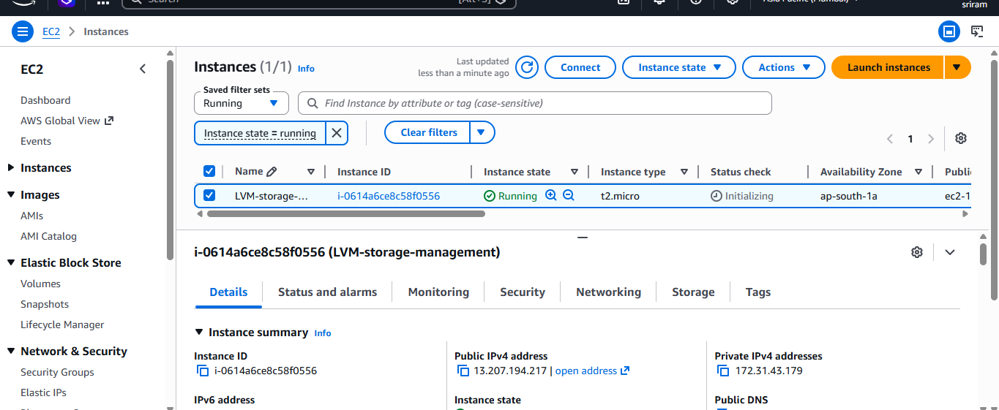

---

# Step 2 - Verify Initial Storage Layout

Verified the default storage configuration before attaching additional storage.

Commands Used:

```bash
lsblk
df -h
```

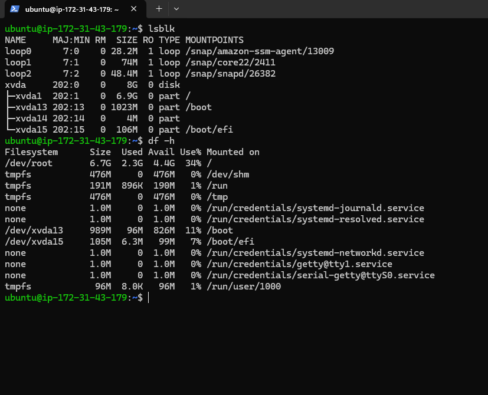

---

# Step 3 - Create and Attach EBS Volumes

Created and attached additional EBS volumes to the running EC2 instance.

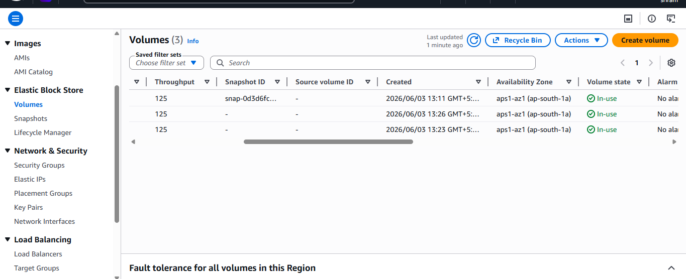

---

# Step 4 - Verify New Disks

Verified that Linux detected the newly attached EBS volumes.

Command:

```bash
lsblk
```

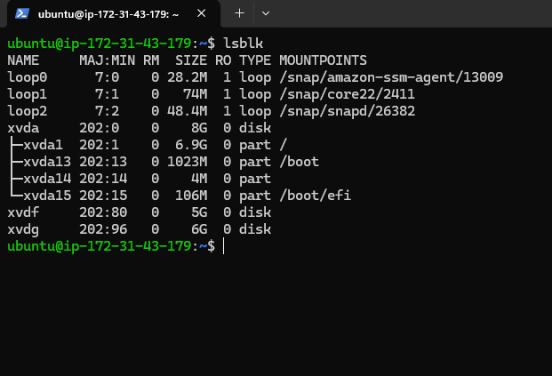

---

# Step 5 - Create Physical Volumes (PV)

Initialized the attached EBS volumes as LVM Physical Volumes.

Commands:

```bash
sudo pvcreate /dev/xvdf
sudo pvcreate /dev/xvdg
```

Verification:

```bash
sudo pvs
```

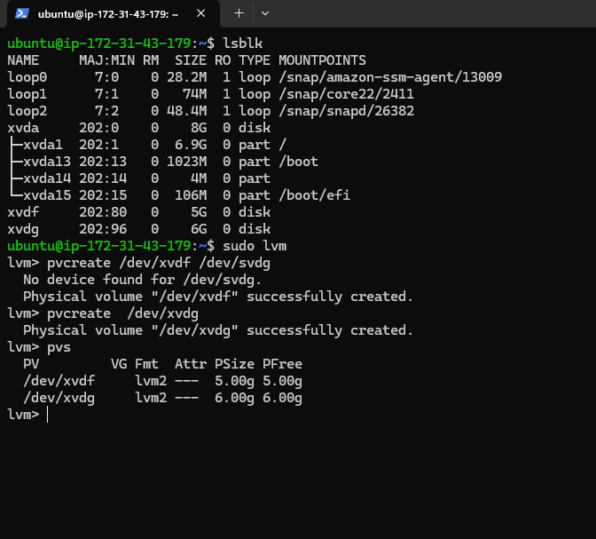

---

# Step 6 - Create Volume Group (VG)

Combined the Physical Volumes into a single storage pool named `vg_data`.

Command:

```bash
sudo vgcreate vg_data /dev/xvdf /dev/xvdg
```

Verification:

```bash
sudo vgs
```

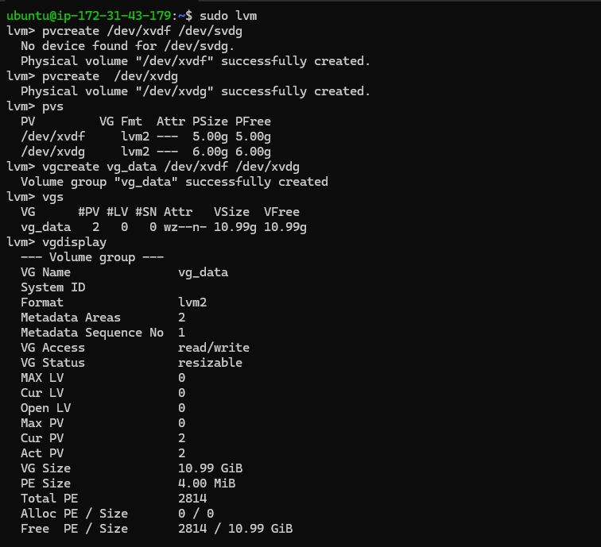

---

# Step 7 - Create Logical Volume (LV)

Created a Logical Volume named `lv_data`.

Command:

```bash
sudo lvcreate -L 8G -n lv_data vg_data
```

Verification:

```bash
sudo lvs
```

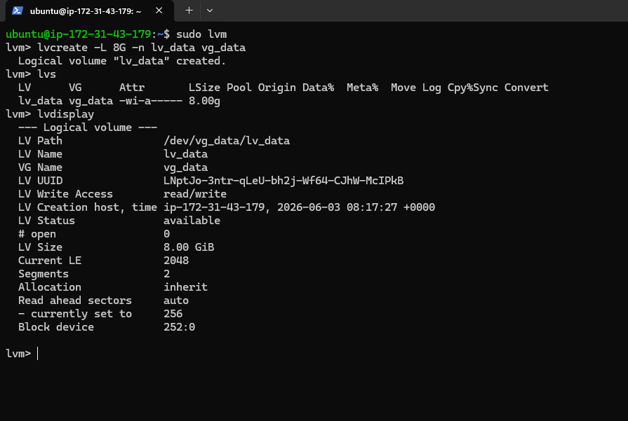

---

# Step 8 - Create EXT4 Filesystem

Formatted the Logical Volume with an EXT4 filesystem.

Command:

```bash
sudo mkfs.ext4 /dev/vg_data/lv_data
```

Verification:

```bash
sudo blkid /dev/vg_data/lv_data
```

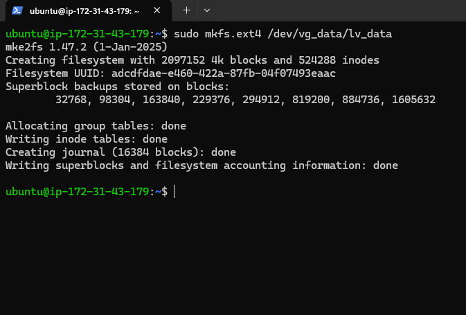

---

# Step 9 - Mount the Logical Volume

Mounted the filesystem to `/data`.

Commands:

```bash
sudo mkdir /data
sudo mount /dev/vg_data/lv_data /data
```

Verification:

```bash
df -h
```

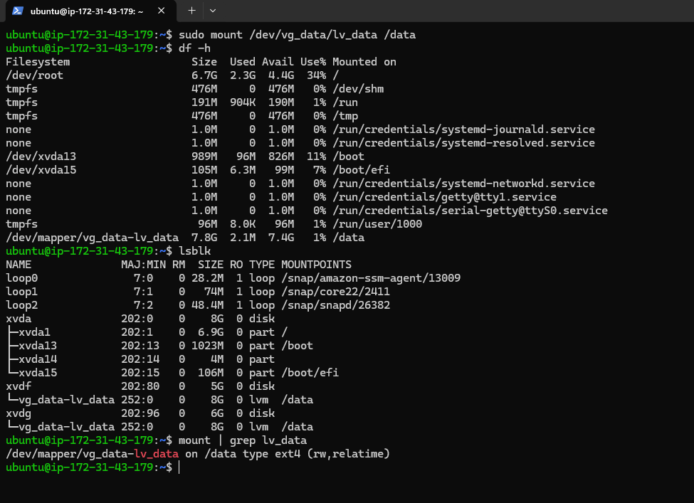

---

# Step 10 - Create Test Data

Created sample files and verified read/write operations on the mounted volume.

Commands:

```bash
cd /data
mkdir devops
cd devops

echo "LVM Storage Project on AWS" > project.txt

```

Verification:

```bash
ls -lh

cat project.txt
```

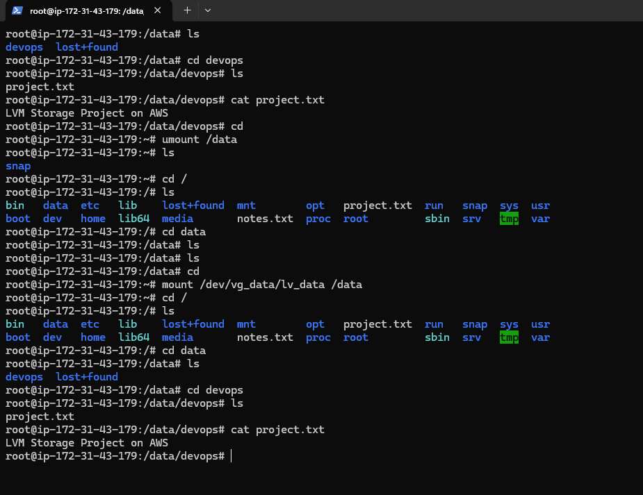

---

# Step 11 - Add Additional Storage

Created and attached an additional EBS volume to the running EC2 instance.

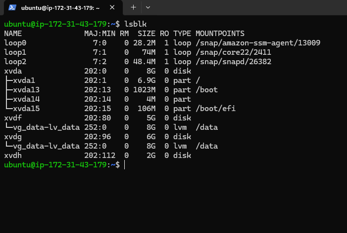

---

# Step 12 - Extend Volume Group

Added the new EBS volume to the existing Volume Group.

Commands:

```bash
sudo pvcreate /dev/xvdh

sudo vgextend vg_data /dev/xvdh
```

Verification:

```bash
sudo vgs

sudo pvs
```

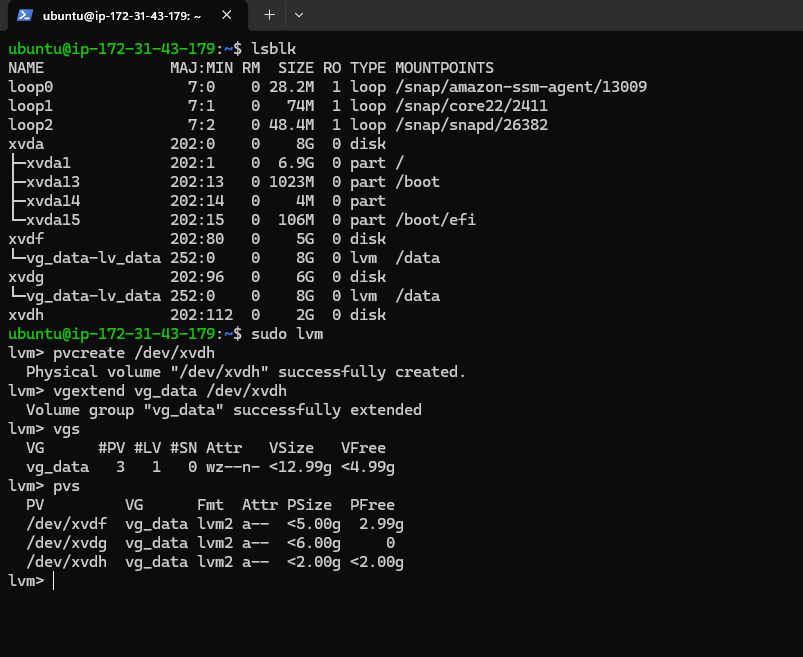

---

# Step 13 - Extend Logical Volume

Extended the Logical Volume using the newly available storage.

Command:

```bash
sudo lvextend -l +100%FREE /dev/vg_data/lv_data
```

Verification:

```bash
sudo lvs
```

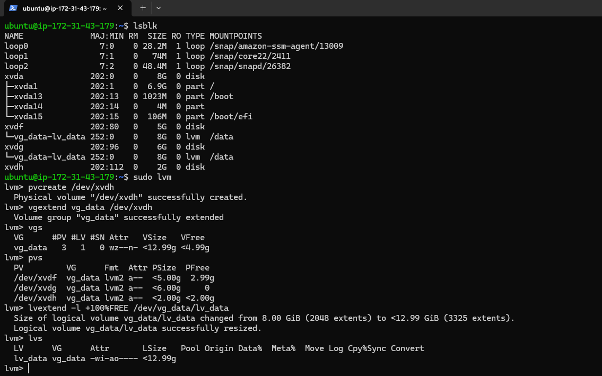

---

# Step 14 - Resize Filesystem

Expanded the EXT4 filesystem online to utilize the newly allocated storage.

Command:

```bash
sudo resize2fs /dev/vg_data/lv_data
```

Verification:

```bash
df -h /data
```

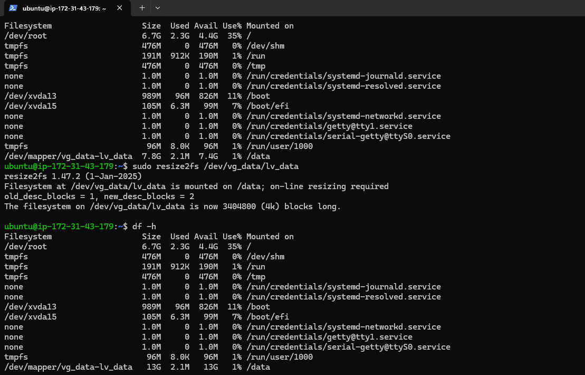

---

# Key Commands Used

```bash
# Create Physical Volumes
sudo pvcreate /dev/xvdf
sudo pvcreate /dev/xvdg

# Create Volume Group
sudo vgcreate vg_data /dev/xvdf /dev/xvdg

# Create Logical Volume
sudo lvcreate -L 8G -n lv_data vg_data

# Create Filesystem
sudo mkfs.ext4 /dev/vg_data/lv_data

# Mount Filesystem
sudo mount /dev/vg_data/lv_data /data

# Add New Storage
sudo pvcreate /dev/xvdh
sudo vgextend vg_data /dev/xvdh

# Extend Logical Volume
sudo lvextend -l +100%FREE /dev/vg_data/lv_data

# Resize Filesystem
sudo resize2fs /dev/vg_data/lv_data
```

---

# Key Skills Demonstrated

* AWS EC2 Administration
* AWS EBS Management
* Linux Storage Administration
* Logical Volume Manager (LVM)
* Physical Volumes (PV)
* Volume Groups (VG)
* Logical Volumes (LV)
* EXT4 Filesystem Management
* Online Storage Expansion
* Production-Style Infrastructure Operations

---

# Project Outcome

Successfully implemented a scalable storage solution using AWS EBS and Linux LVM. Storage capacity was expanded dynamically without data loss, demonstrating a common real-world Linux system administration and cloud infrastructure task.

---

